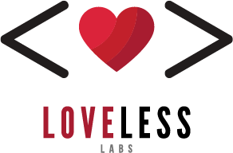

# Cloud Admin User Provisioning API Spec

> The Cloud Admin User Provisioning API schema over time.

The Cloud Admin User Provisioning API documentation is located [here](https://developer.atlassian.com/cloud/admin/user-provisioning/rest/intro/) on the Atlassian Developer website.

This **unofficial** repository aims to document the small (or large) changes to the API specification provided by Atlassian for this API.

## What's Here

* `schema-original.json`
  The original json file we downloaded from Atlassian.
* `schema.json`
  A pretty-printed version of `schema-original.json`
* `schema.yaml`
  A YAML representation of `schema.json`
* `modular/`
  A modular version of the API, broken up into multiple YAML files.

## How it works

1. We check the schema regularly for changes.

2. When a change occurs, we update the repository with those changes.

3. We create a release based on when we noticed the change.

Releases are named based on the date **we** first saw the schema change—they are *not* official release names from Atlassian's perspective.

## Thanks

This repository is sponsored by [Loveless Labs](https://lovelesslabs.com).

Furthermore, thanks to:

* [Redocly](https://redocly.com/) for the handy [redocly split](https://redocly.com/docs/cli/commands/split/) tool.
* The good folks at the [OpenAPI Initiative](https://www.openapis.org/)
* And of course, [Atlassian](https://developer.atlassian.com/) for providing the source specs.

### Disclaimers

Use the information here at your own risk. It may be out of date, inaccurate, or otherwise horribly broken. (Obviously, we're trying to make it accurate!) Contributors to this repository are not responsible for any problems that may arise from the use of the information contained within. We just thought it would be helpful, and thought you might find it useful also.
